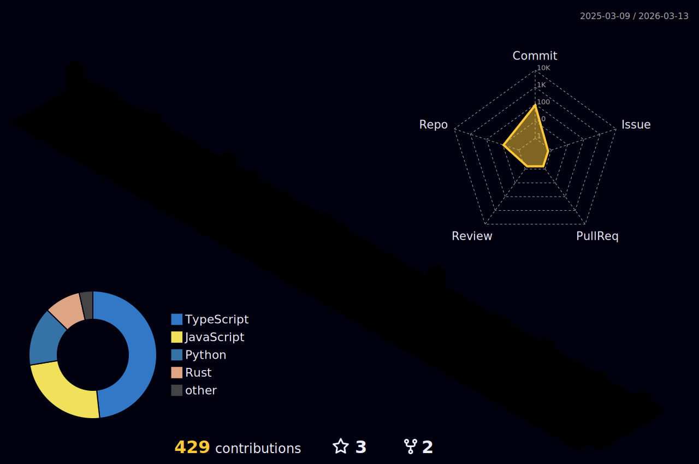

<!-- ANIMATED HEADER -->
<p align="center">
  
</p>

<!-- ANIMATED BADGES -->
<p align="center">
  <a href="https://github.com/cheongcode">
    
  </a>
  <a href="https://github.com/cheongcode?tab=followers">
    
  </a>
  <a href="https://github.com/cheongcode?tab=stars">
    
  </a>
</p>

<!-- TYPING SVG - MULTIPLE LINES -->
<p align="center">
  
</p>

<!-- ANIMATED GIF -->
<p align="center">
  
</p>

---

<!-- PROFILE WIDGET BOX -->
<p align="center">
  <a href="https://github.com/cheongcode">
    
  </a>
</p>

---

## ⚡ `whoami`

```python
#!/usr/bin/env python3
# -*- coding: utf-8 -*-

class Brandon:
    def __init__(self):
        self.name = "Brandon Cheong"
        self.location = "🇸🇬 Singapore"
        self.roles = ["Full-stack Developer", "Security Engineer", "Educator"]
        self.focus = ["Offensive Security", "Cloud Architecture", "Automation", "CTF"]
        self.languages = ["en_US", "zh_CN"]
        self.current_status = "Building secure systems by day, breaking them by night"

    def __str__(self):
        return f"👋 Hey, I'm {self.name} — sleep-deprived and caffeinated!"

if __name__ == "__main__":
    me = Brandon()
    print(me)
```

---

## 🏷️ Connect

<p align="center">
  <a href="https://linkedin.com/in/cheongbrandon">
    
  </a>
  <a href="mailto:brandoncheong22@gmail.com">
    
  </a>
  <a href="https://github.com/cheongcode">
    
  </a>
</p>

---

## 🧩 Tech Arsenal

<!-- LANGUAGES -->
<p align="center">
  
</p>

<!-- FRAMEWORKS & TOOLS -->
<p align="center">
  
</p>

<p align="center">
  
</p>

<!-- ANIMATED SKILL ICONS -->
<p align="center">
  <a href="https://skillicons.dev">
    
  </a>
</p>

---

## 🏆 Achievements

<p align="center">
  
</p>

---

## 📈 GitHub Analytics

<p align="center">
  
  
</p>

<p align="center">
  
</p>

---

## 📊 Contribution Graph

<p align="center">
  
</p>

---

## 🧱 Profile Insights

<p align="center">
  
</p>

<p align="center">
  
  
  
</p>

---

## ✍️ Random Dev Wisdom

<p align="center">
  
</p>

---

## 🐍 Contribution Snake

<p align="center">
  <picture>
    <source media="(prefers-color-scheme: dark)" srcset="https://raw.githubusercontent.com/cheongcode/cheongcode/output/snake-dark.svg" />
    <source media="(prefers-color-scheme: light)" srcset="https://raw.githubusercontent.com/cheongcode/cheongcode/output/snake.svg" />
    
  </picture>
</p>

---

## 🧊 3D Contributions

<p align="center">
  
</p>

---

<!-- ANIMATED FOOTER -->
<p align="center">
  
</p>

<!-- SECRET SAUCE -->
<p align="center">
  
</p>
